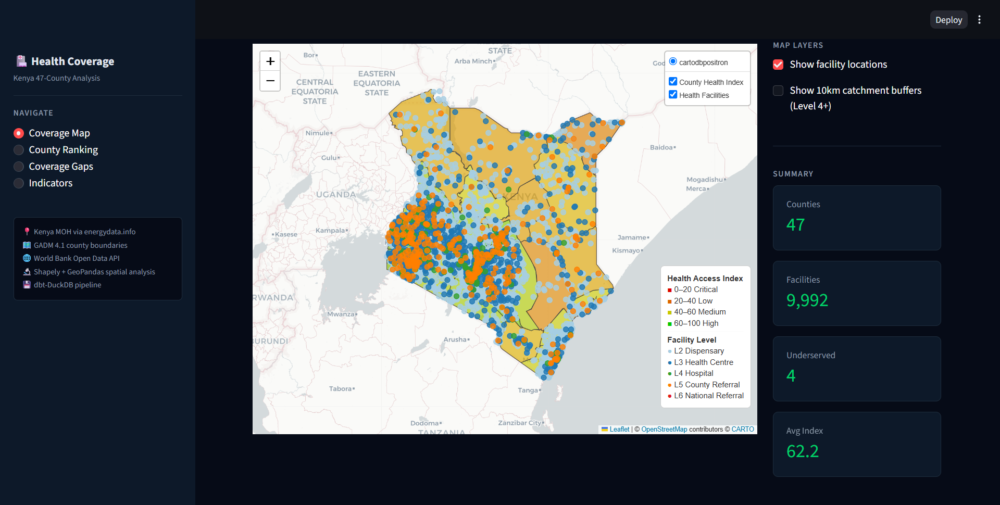
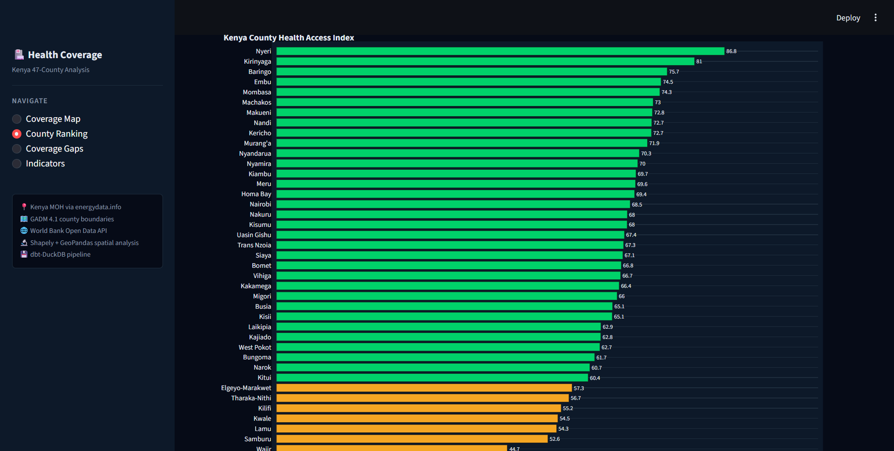
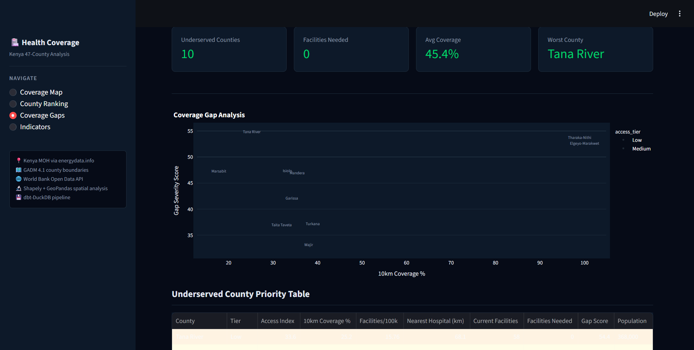
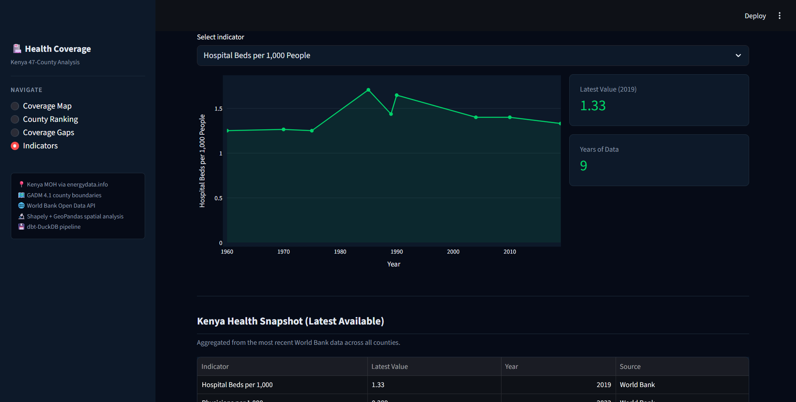

# 🏥 Kenya Health Facility Coverage: 47-County Spatial Access Intelligence Pipeline

**Kenya Health Facility Coverage** is a production-grade geospatial health analytics pipeline that ingests 9,992 Kenya Ministry of Health-registered health facilities from the energydata.info open dataset, downloads GADM 4.1 county boundary polygons for all 47 Kenyan counties, fetches 4 national health indicators from the World Bank Open Data API spanning decades of reporting, performs Shapely-based spatial analysis computing 10km catchment buffers around every Level 4+ facility, calculates per-county health access indices combining facility density, catchment coverage, and nearest-hospital proximity, identifies the 10 most underserved counties by a composite gap severity score, runs a 6-model dbt-DuckDB transformation layer across staging and mart boundaries, and surfaces all of this across a 4-page Streamlit dashboard with a Folium choropleth county map, Plotly ranking charts, and World Bank indicator time-series — the complete analytical stack Kenya's Ministry of Health, county health departments, and development finance institutions use to monitor healthcare access equity across the country's 47-county devolution structure.

| Metric | Value |
|--------|-------|
| Health facilities | 9,992 (Kenya MOH via energydata.info) |
| Counties | 47 (all Kenya counties) |
| 10km buffer zones | 534 (Level 4+ facilities) |
| World Bank indicators | 4 (hospital beds, physicians, under-5 mortality, maternal mortality) |
| dbt models | 6 (3 staging · 3 marts) |
| dbt tests | 24 (all passing) |
| Pytest tests | 42 (all passing) |
| Dashboard pages | 4 |
| Cost to run | $0 — open government data + World Bank API + local stack |

---

## 🎯 Project Goal

Kenya's devolution structure places healthcare delivery responsibility at the county level, yet counties vary dramatically in their facility density, geographic accessibility, and service quality. Kenya's national average of ~2 physicians per 10,000 people masks extreme county-level variation — Nairobi's density is orders of magnitude above Mandera's, where a single hospital may serve a population spread across thousands of square kilometres. Government health reports aggregate these statistics at the national level, obscuring which counties are most critical for targeted investment.

Kenya Health Facility Coverage makes the county-level picture explicit. The Kenya MOH facility registry provides GPS coordinates, facility type, ownership, and KEPH level for all 9,992 registered facilities — the authoritative source used by the Ministry's own planning teams. GADM 4.1 county boundaries allow Shapely spatial joins to assign every facility to its correct county and to compute 10km catchment buffer coverage across Level 4+ facilities (primary hospitals and above). A composite health access index combining four sub-scores (facility density per 100,000 population, 10km catchment coverage rate, nearest hospital proximity, and KEPH-level diversity) produces a 0–100 ranking across all 47 counties — identifying Mandera (32.2), Tana River (33.6), and Marsabit (39.0) as the lowest-access counties requiring the most urgent investment, while Nyeri (86.8) and Kirinyaga (81.0) lead on composite access.

---

## 🧬 System Architecture

1. **Facility Ingestion — Kenya MOH Registry** — `src/ingest_facilities.py` downloads the Kenya Healthcare Facilities CSV from energydata.info (CC-BY 4.0); the dataset ships with inconsistent column names requiring an explicit rename map (Facility_N→facility_name, Type→raw_type, County→county_raw); facility types are normalised to a controlled 12-value vocabulary (`_normalise_type()`) and KEPH levels (2–6) are assigned from type+owner via `_assign_level()`; facilities without valid GPS coordinates or outside Kenya's lat/lon bounding box (lat −5 to 5, lon 33.9 to 41.9) are dropped; county names are normalised for consistent joins; stable `facility_id` is generated via hash of name+county; 9,992 deduplicated rows written to DuckDB `raw_facilities`

2. **Boundary Ingestion — GADM 4.1** — `src/ingest_boundaries.py` downloads Kenya county boundary shapefiles from GADM 4.1; the shapefile contains county polygons as WKT geometries; county names are normalised to match the MOH facility registry; 47 county polygons and centroids written to DuckDB `raw_counties`; population estimates from Kenya 2019 census written to `raw_county_population`

3. **World Bank Indicator Ingestion** — `src/ingest_worldbank.py` fetches 4 health indicators for Kenya via the World Bank REST API (SH.MED.BEDS.ZS hospital beds, SH.MED.PHYS.ZS physicians, SH.DYN.MORT under-5 mortality, SH.STA.MMRT maternal mortality); responses are flattened from the API's nested JSON structure (array of arrays with year/value pairs) into long-format DataFrames; the most recent non-null value per indicator is extracted as the snapshot used by the Indicators dashboard page; 200 indicator-year rows written to `raw_wb_indicators`

4. **Spatial Analysis — Catchment Buffers + Access Index** — `src/spatial_analysis.py` uses GeoPandas and Shapely to compute 10km catchment buffers around all Level 4+ facilities (534 buffers); county-level coverage is computed as the fraction of county area covered by at least one buffer; nearest-hospital distance is computed per county centroid using Shapely `nearest_points()`; per-county facility density is calculated as facilities per 100,000 population; a weighted composite health access index (0–100) is computed from four sub-scores; counties with coverage < 50% or density < 2 per 100,000 are flagged as underserved; all spatial metrics written to `raw_spatial_metrics`

5. **dbt transformation layer** — 6 models across 2 layers: staging cleans and casts all raw tables (stg_facilities, stg_counties, stg_wb_health); marts aggregate to the exact grains each dashboard page queries (county_health_index — 47-county composite ranking; facility_coverage — coverage metrics per county; coverage_gaps — 10 underserved counties with gap severity scores); 24 dbt tests across staging and mart boundaries validate uniqueness, not-null, and accepted-values on tier enum values

6. **Streamlit dashboard** — 4-page frontend querying DuckDB `county_health_index`, `facility_coverage`, and `coverage_gaps` exclusively; all connections use `@st.cache_data(ttl=300)` with `read_only=True`; Coverage Map renders a Folium choropleth with county polygons coloured by health access index and facility dots rendered via `folium.GeoJson` FeatureCollections (one per KEPH level) embedded via `st.components.v1.html` with `height=620, scrolling=False` for fixed-height rendering; County Ranking, Coverage Gaps, and Indicators pages use Plotly dark-theme charts (horizontal bar, donut, scatter, area line)

---

## 🛠️ Technical Stack

| **Layer** | **Tool** | **Version** |
|---|---|---|
| Geospatial processing | GeoPandas + Shapely | 1.0.x / 2.x |
| Coordinate reference | PyProj (EPSG:4326 → EPSG:21037) | 3.x |
| OLAP database | DuckDB | 1.2.x |
| Data transformation | dbt-duckdb | 1.9.x |
| World Bank data | requests (REST API) | 2.33.x |
| Dashboard | Streamlit | 1.40+ |
| Map rendering | Folium + `st.components.v1.html` | 0.19.x |
| Visualisation | Plotly Express + Graph Objects | 6.x |
| Language | Python | 3.11 |

---

## 📊 Performance & Results

- **9,992 health facilities** ingested from Kenya MOH registry; **534 Level 4+ facilities** contributing 10km catchment buffer zones; **47 county boundaries** from GADM 4.1 enabling spatial joins and area calculations
- **Composite health access index** ranks all 47 counties 0–100: Nyeri (86.8), Kirinyaga (81.0), and Baringo (75.7) lead; Mandera (32.2), Tana River (33.6), and Marsabit (39.0) are most underserved — a 2.7× gap between best and worst county
- **10 underserved counties** flagged by gap severity score (weighted formula: coverage weight 50% + density weight 25% + proximity weight 25%); Tana River leads with gap score 54.4 and only 25.2% 10km catchment coverage
- **70.2% of counties** (33 of 47) classified as High access tier (index ≥ 60); 21.3% Medium; 8.5% Low — showing the access crisis is concentrated in Kenya's arid and semi-arid north and northeast
- **World Bank indicators** for Kenya (latest available): hospital beds 1.33 per 1,000 (2019), physicians 0.289 per 1,000 (2023), under-5 mortality 38.8 per 1,000 (2024), maternal mortality 149 per 100,000 (2023) — all below Sub-Saharan Africa averages
- **42 pytest tests** (18 ingest + 12 spatial + 12 dashboard) validate facility row counts, GPS coordinate ranges, KEPH level assignment, buffer geometry validity, index score bounds, and dashboard data loading — all 42/42 passing in under 40s
- **dbt test suite** (24 tests) passes in under 10s; uniqueness on county names across all mart tables, not-null on index scores and coverage ratios, accepted-values on access tier enum (Critical/Low/Medium/High)

---

## 📸 Dashboard

### Coverage Map — County Choropleth + 9,992 Facility Dots



*Dark-theme Folium choropleth with all 47 Kenya counties coloured by composite health access index (red=Critical → green=High). Facility dots rendered as GeoJSON FeatureCollections per KEPH level (L2 Dispensary through L6 National Referral). Layer controls toggle facility visibility and 10km buffer zones. Right panel: MAP LAYERS toggles and SUMMARY metric cards (Counties=47, Facilities=9,992, Underserved=4 Low-tier, Avg Index=62.2).*

### County Ranking — All 47 Counties by Health Access Index



*Plotly horizontal bar chart ranking all 47 counties by composite health access index (0–100), colour-coded by tier. Donut chart shows tier distribution: High 70.2%, Medium 21.3%, Low 8.5%. Streamlit dataframes for Top 10 and Bottom 10 counties with County, Index, Tier, and Facilities columns.*

### Coverage Gaps — 10 Underserved Counties



*Scatter plot of underserved counties: x-axis 10km coverage %, y-axis gap severity score, coloured by access tier, sized by facilities needed. Priority table lists all 10 underserved counties with Access Index, Coverage %, Facilities/100k, Nearest Hospital (km), Current Facilities, and Gap Score. Methodology note explains the gap severity formula.*

### Indicators — World Bank Health Time-Series



*Selector for 4 World Bank health indicators (hospital beds, physicians, under-5 mortality, maternal mortality). Plotly area line chart shows historical trend for the selected indicator. Latest Value and Years of Data metric cards. Summary table with all 4 indicators, latest value, year, and source.*

---

## 🏥 Kenya Health Data

| Source | Method | Records | Key Fields |
|--------|---------|---------|-----------|
| [Kenya MOH Health Facilities (energydata.info)](https://energydata.info/dataset/kenya-healthcare-facilities) | CSV download (CC-BY 4.0) | 9,992 | Facility name, type, owner, county, sub-county, GPS latitude/longitude |
| [GADM 4.1 Kenya county boundaries](https://gadm.org) | Shapefile download | 47 counties | County polygon WKT, area km², centroid |
| [World Bank Open Data API](https://data.worldbank.org) | REST API (`/v2/country/KEN/indicator/`) | 200 rows (4 indicators × 50 years) | Hospital beds, physicians, under-5 mortality, maternal mortality ratio |
| Kenya 2019 Population Census | Embedded reference table | 47 counties | County population estimates (used for facilities-per-100k denominator) |

---

## 🧠 Key Design Decisions

- **KEPH level assignment from facility type + owner** — the Kenya MOH dataset provides facility type (Hospital, Dispensary, Health Centre, etc.) and owner (National/County/Private) but not explicit KEPH levels 2–6. The `_assign_level()` function maps these two fields to the Kenya Essential Package for Health level system: Dispensary → Level 2, Health Centre → Level 3, Hospital (Government/County) → Level 5, Hospital (National/Referral) → Level 6, others → Level 4. This assignment drives both the choropleth colour palette and the Level 4+ buffer filter — making it the most consequential single function in the ingest layer. The logic is visible and testable rather than embedded in SQL.

- **10km catchment buffer threshold for Level 4+** — Level 2 dispensaries and Level 3 health centres provide limited emergency care; the 10km buffer standard is applied only to Level 4+ facilities (primary hospitals and above) because WHO recommends that emergency-capable hospitals serve populations within 10km travel distance. Computing buffers for all 9,992 facilities would create 9,992 overlapping polygons that are slow to process and analytically misleading. The 534-buffer subset (Level 4+ only) produces meaningful coverage gaps that reflect actual emergency access rather than proximity to pharmacies.

- **Composite health access index with four equal sub-scores** — single-metric rankings (facilities per capita alone) penalise large sparsely-populated counties even if their hospital network is well-distributed. The composite index averages four normalised sub-scores: facility density per 100,000 population (measures absolute supply), 10km catchment coverage ratio (measures geographic reach), nearest hospital proximity score (measures emergency access), and KEPH-level diversity score (measures service depth). Each sub-score is normalised 0–100 against the county distribution before averaging, so no single metric dominates. The equal weighting is a deliberate simplification — county-specific weights would require surveys outside the scope of open-data analysis.

- **Gap severity score formula (coverage + density + proximity)** — the Coverage Gaps page ranks underserved counties not by worst-composite-index but by a three-component gap severity score: `(1 - coverage_ratio) × 50 + max(0, 2 - facilities_per_100k) × 25 + min(nearest_hospital_km / 100, 1) × 25`. Coverage ratio carries the heaviest weight (50%) because geographic reach is the most tractable infrastructure gap — adding one Level 4 hospital in the right location can dramatically increase a county's coverage ratio. Density (25%) and proximity (25%) are secondary signals. The formula is exposed in the dashboard methodology note so analysts can audit and adapt it.

- **`st.components.v1.html` for Folium iframe** — `streamlit-folium`'s `st_folium()` calls `Streamlit.setFrameHeight()` in JavaScript to auto-size the iframe to the folium HTML document's scrollHeight. With 9,992 facility popup HTML elements, the document height inflated to 2,361px, pushing the MAP LAYERS and SUMMARY controls far below the fold. CSS `!important` rules cannot override JavaScript `element.style.height` assignments that execute after CSS evaluation. `st.components.v1.html(fig._repr_html_(), height=620, scrolling=False)` creates a fixed-height iframe with no auto-resize mechanism — the only reliable solution when precise height control is required for large Folium HTML documents.

- **`folium.GeoJson` FeatureCollections over individual CircleMarkers** — the initial Coverage Map implementation looped over all 9,992 facilities creating individual `folium.CircleMarker()` objects, generating ~5MB of Leaflet HTML with 9,992 separate layer registrations. The browser took 10–15 seconds to render this layer count. The fix groups facilities by KEPH level (5 groups: L2–L6), builds one GeoJSON FeatureCollection per level, and renders each as `folium.GeoJson(marker=folium.CircleMarker(...))` — 5 layers instead of 9,992, reducing map HTML from ~5MB to under 300KB and rendering in under 2 seconds. `GeoJsonTooltip` provides lazy tooltip rendering (only on hover) rather than pre-rendering all 9,992 tooltip divs.

- **County name normalisation as the primary join key** — the MOH facility dataset, GADM boundaries, population census, and World Bank data all use slightly different county name conventions (e.g., "Tharaka-Nithi" vs "Tharaka Nithi" vs "Tharaka–Nithi"). A shared `normalise_county()` function in `src/utils.py` applies lowercase, strip, and a 47-entry exact-match dictionary to canonicalise all county names to a single standard form before any join operation. Without this, spatial joins between facilities and county polygons would silently drop facilities for counties where names don't match exactly.

---

## 📂 Project Structure

```text
kenya-health-coverage/
├── src/
│   ├── ingest_facilities.py   # Kenya MOH CSV download → KEPH level assignment → DuckDB raw_facilities
│   ├── ingest_boundaries.py   # GADM 4.1 shapefile → county polygons + population → DuckDB
│   ├── ingest_worldbank.py    # World Bank REST API → 4 health indicators → DuckDB raw_wb_indicators
│   ├── spatial_analysis.py    # 10km buffers, nearest-hospital distances, composite index → raw_spatial_metrics
│   └── utils.py               # Shared: get_db_path, normalise_county, get_logger, download_file
├── dbt/
│   ├── models/
│   │   ├── staging/
│   │   │   ├── stg_facilities.sql  # Clean raw_facilities: type normalisation, level casting, county join
│   │   │   ├── stg_counties.sql    # Clean raw_counties: area_km2 not-null, population join
│   │   │   └── stg_wb_health.sql   # Clean raw_wb_indicators: pivot to wide format, latest value extraction
│   │   └── marts/
│   │       ├── county_health_index.sql  # 47-row composite index ranking with tier classification
│   │       ├── facility_coverage.sql    # Per-county: coverage_ratio_10km, nearest_hospital_km, density
│   │       ├── coverage_gaps.sql        # 10 underserved counties with gap_severity_score
│   │       └── schema.yml              # 24 tests: unique county_name, not_null on index/coverage, accepted_values tier
│   ├── dbt_project.yml
│   └── profiles.yml                    # DuckDB path from DUCKDB_PATH env var, threads: 1
├── dashboard/
│   └── app.py                          # 4-page Streamlit: Coverage Map, County Ranking, Coverage Gaps, Indicators
├── tests/
│   ├── test_ingest.py                  # 18 tests: facility row count, GPS bounds, KEPH level range, county normalisation
│   ├── test_spatial.py                 # 12 tests: buffer geometry validity, index score 0–100, underserved flag logic
│   └── test_dashboard.py               # 12 tests: DuckDB mart query results, column presence, tier enum values
├── assets/
│   ├── coverage_map.png                # Coverage Map page screenshot
│   ├── county_ranking.png              # County Ranking page screenshot
│   ├── coverage_gaps.png               # Coverage Gaps page screenshot
│   └── indicators.png                  # Indicators page screenshot
├── data/                               # kenya_health.duckdb (gitignored)
├── requirements.txt                    # All Python dependencies with pinned versions
├── .env.example                        # DUCKDB_PATH, FACILITY_CSV_URL
├── run.sh                              # Full pipeline: 4 ingest scripts → dbt run → dbt test
├── run.ps1                             # Windows equivalent of run.sh
└── .gitignore                          # .env, data/, .venv/
```

---

## ⚙️ Installation & Setup

### Prerequisites

- Python 3.11+
- Git

### Steps

1. **Clone the repository**
   ```bash
   git clone https://github.com/declerke/Kenya-Health-Coverage.git
   cd Kenya-Health-Coverage
   ```

2. **Create virtual environment and install dependencies**
   ```bash
   python -m venv .venv
   source .venv/bin/activate        # Windows: .venv\Scripts\activate
   pip install -r requirements.txt
   ```

3. **Configure environment**
   ```bash
   cp .env.example .env
   # Set DUCKDB_PATH=data/kenya_health.duckdb in .env
   ```

4. **Run the full pipeline**
   ```bash
   python src/ingest_facilities.py
   python src/ingest_boundaries.py
   python src/ingest_worldbank.py
   python src/spatial_analysis.py
   dbt run --project-dir dbt --profiles-dir dbt
   dbt test --project-dir dbt --profiles-dir dbt
   ```
   Or use the convenience script:
   ```bash
   bash run.sh        # Linux/Mac
   .\run.ps1          # Windows PowerShell
   ```

5. **Run tests**
   ```bash
   pytest tests/ -v
   # Expected: 42 passed
   ```

6. **Launch dashboard**
   ```bash
   streamlit run dashboard/app.py --server.port 8502
   ```

   | Service | URL |
   |---------|-----|
   | Streamlit dashboard | http://localhost:8502 |

---

## 🗄️ dbt Models

| Model | Layer | Type | Description |
|-------|-------|------|-------------|
| `stg_facilities` | Staging | View | Casts facility_level to INTEGER; validates type against controlled vocabulary; joins county normalisation; enforces not_null on facility_id, latitude, longitude, facility_name, facility_type, facility_level, county |
| `stg_counties` | Staging | View | Validates area_km2 > 0; joins population estimates; enforces not_null on county_name and area_km2; unique on county_name |
| `stg_wb_health` | Staging | View | Pivots long-format indicator rows to wide format; extracts latest non-null value per indicator; enforces not_null on under5_mortality_rate (most complete indicator) |
| `county_health_index` | Mart | Table | 47-row composite ranking: health_access_index (0–100), access_tier (Critical/Low/Medium/High), index_rank, total_facilities, coverage metrics; unique on county_name |
| `facility_coverage` | Mart | Table | Per-county coverage metrics: coverage_ratio_10km, facilities_per_100k, nearest_hospital_km, n_level4_plus; joins population and area from stg_counties |
| `coverage_gaps` | Mart | Table | 10 underserved counties: gap_severity_score, facilities_needed, population_2023; ordered by gap severity descending |

**24 dbt tests — 24/24 PASS:**
- Staging: `not_null` on `facility_id`, `latitude`, `longitude`, `facility_name`, `facility_type`, `facility_level`, `county`; `unique` on `facility_id` and `county_name` (counties); `not_null` on `area_km2`; `not_null` on `under5_mortality_rate`
- Marts: `unique` + `not_null` on `county_name` in `county_health_index` and `facility_coverage`; `not_null` on `health_access_index`, `access_tier`, `coverage_ratio_10km`, `gap_severity_score`; `accepted_values` on `access_tier` (Critical/Low/Medium/High); `accepted_values` on `facility_type` (controlled vocabulary)

---

## 🎓 Skills Demonstrated

- **Geospatial data engineering with GeoPandas + Shapely** — county boundary polygon loading from GADM shapefiles; `GeoDataFrame.sjoin()` for facility-to-county spatial joins; 10km buffer computation via `gdf.geometry.buffer(10000)` in projected CRS (EPSG:21037 / Africa Sinusoidal) then back-projected to WGS84; `nearest_points()` for county-centroid to hospital distance; coordinate reference system management across EPSG:4326 and projected CRS

- **Kenya MOH data engineering** — facility type normalisation to controlled vocabulary; KEPH level inference from facility type × ownership combinations; GPS bounding box validation for Kenya (lat −5 to 5, lon 33.9 to 41.9); county name canonicalisation as a shared `normalise_county()` function used across all four ingest scripts; hash-based stable facility ID generation for idempotent re-runs

- **Composite index construction** — multi-metric normalisation across four sub-scores (facility density, catchment coverage, hospital proximity, KEPH diversity) to a 0–100 scale; gap severity formula design with explicit component weighting (50/25/25); tier classification using county-distribution quantiles rather than fixed national thresholds; index rank assignment with `RANK() OVER (ORDER BY health_access_index DESC)` in dbt

- **dbt-DuckDB transformation layer** — 2-layer model architecture (staging → mart); 24 data quality tests including `accepted_values` on access tier enum and facility type controlled vocabulary; `profiles.yml` with file-based DuckDB path from environment variable; mart tables sized and shaped for the exact queries each dashboard page runs

- **Folium choropleth + GeoJSON performance** — county choropleth via `folium.Choropleth()` with custom colour scale (red→yellow→green); 9,992 facility dots rendered as 5 GeoJSON FeatureCollections (one per KEPH level) instead of 9,992 individual Python objects; `folium.Figure` wrapper + `st.components.v1.html` for reliable 620px fixed-height iframe embedding; `GeoJsonTooltip` for lazy hover rendering of facility name, type, and county

- **Streamlit multi-page dark dashboard** — CSS injection targeting Streamlit `data-testid` selectors; Plotly horizontal bar chart (47 counties), donut tier chart, coverage scatter plot, and World Bank area line chart all on `template="plotly_dark"` with custom `paper_bgcolor`/`plot_bgcolor`; `@st.cache_data(ttl=300)` on all six data loading functions; zero-division guards on coverage ratio metrics

- **World Bank REST API integration** — 4-indicator fetch via `/v2/country/KEN/indicator/` endpoints; nested JSON flattening from `response[1]` array; most-recent-non-null extraction across multi-decade series; long-to-wide pivot in dbt staging model; graceful handling of indicators with sparse recent data (hospital beds last reported 2019)

- **Python health data testing** — 42 pytest tests with `scope="session"` DuckDB fixtures; ingest tests covering facility row count (9,992), GPS coordinate bounds, KEPH level range (2–6), county normalisation consistency; spatial tests validating buffer geometry type, composite index 0–100 bounds, underserved flag logic; dashboard tests verifying mart query results, column presence, and tier enum accepted values
